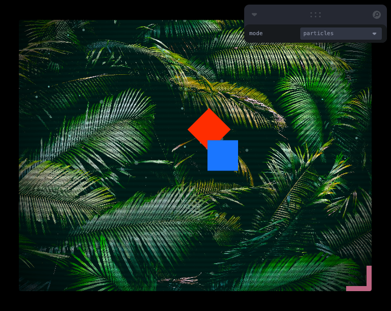

# react-pixi-starter

Example of a Pixi WebGL canvas invoked and destroyed within the React lifecycle

[View demo](https://loksland.github.io/react-pixi-starter/)

### Features

- Supports React strict mode
- Multiple concurrent Pixi canvases
- Hot module reloading
- Typesafe
- Retina display
- Demo includes filters, animation (with GSAP), particles, loader

### Attributes

Placeholder photos by [Su San Lee](https://unsplash.com/@blackodc?utm_content=creditCopyText&utm_medium=referral&utm_source=unsplash)
